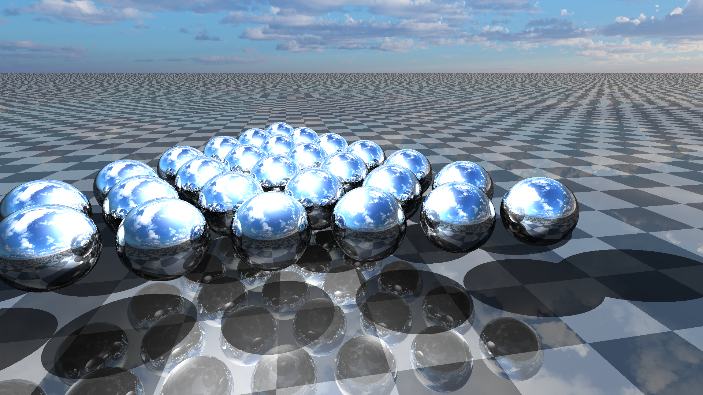
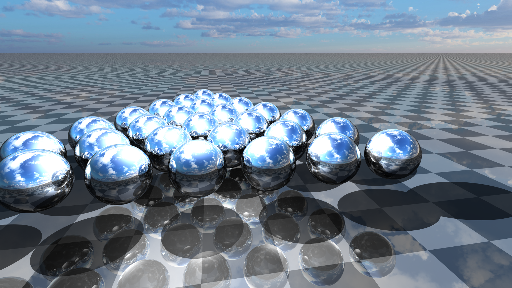

# An Evaluation of Approaches to anti-aliasing in ray traced Computer Graphics 
Extended Essay: Implementation and evaluation of four different anti-aliasing algorithms: Super Sampler, Adaptive Super Sampler, Stochastic Super Sampler and Adaptive Stochastic Super Sampler. These implementations are based on and built upon the [pure java ray tracer of carl-vbn](https://github.com/carl-vbn/pure-java-raytracer).

Image rendered without using anti-aliasing algorithms.

Image rendered using the Stochastic Super Sampler.